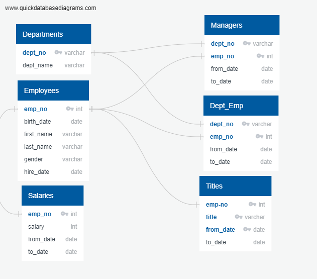
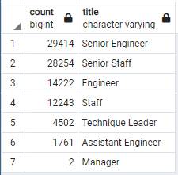
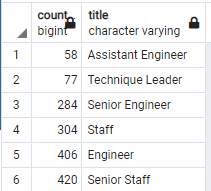

# Pewlett Hackard Analysis

## Project Overview

This analysis used employee data to assist Pewlett Hackard in determining the number and departments of upcoming retirees to forecast hiring needs. The data was also used to determine potential employees eligible to serve in a mentorship program.

## Resources

### Data Sources 
* departments.csv
* dept_emp.csv
* dept_manager.csv
* employees.csv
* salaries.csv
* titles.csv

### Software 
* SQL
* PostgreSQL
* pgAdmin

## Results

The analysis included the creation of an Entity Relationship Diagram to help visualize the connections between the data sources, see below:

Using the data available and the retirement-eligible birthdate range of January 1, 1952 - December 31, 1955, the following number of employees were found at retirement age  for each title:

 

Analysis was also completed to determine the number of employees that would be available to participate in a mentorship program to hype train new hire employees. This complete list can be found in mentorship_eligibility.csv, with the total number being 1,549.

* The two titles most affected by the retirement  wave will be Senior Engineer and Senior Staff
* The total number of potential retirees comes in at 90,398
* The Manager roles are least affected
* Senior Engineering and Senior Staff make up over 50% of retirees

## Pewlett-Hackard Analysis Summary

As the “silver tsunami”  begins to take its toll, there will be 90,398 roles that need to be filled.
The potential number of mentors available is 1,549. This ratio of approximately 58 to 1 is unrealistic for a population who will be coming up upon retirement following the silver tsunami.  

Below, the number of potential mentors by title is shown:

 

There are currently no potential mentors for the Manager positions and even the positions with available mentors are severely outnumbered by the positions that will be filled.

At this point, Pewlett-Hackard should consider other options such as retire/rehire to help supplement the mentorship program.
